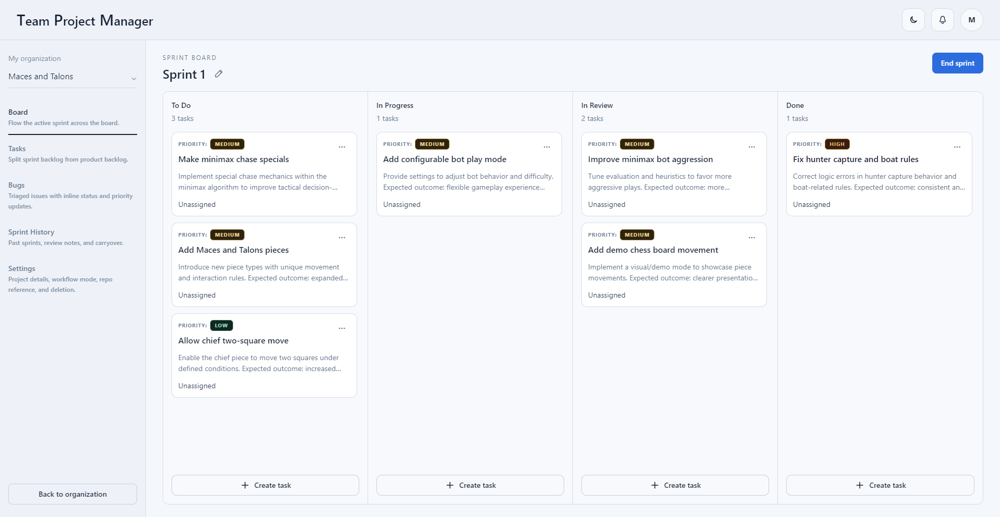

# Team Project Manager

Team Project Manager is a full-stack web application for organizing software work in one place. It helps a team create organizations and projects, manage tasks and bug reports, run sprints, invite collaborators, connect GitHub repositories, and keep track of work as it moves from planning to completion.



## What This Project Does

This project is designed to feel like a lightweight project hub for a development team.

In practical terms, it lets users:

- create organizations and projects
- manage tasks and bug reports
- group work into sprints or use a continuous workflow
- assign work to team members with role-based permissions
- comment on work items and mention teammates
- connect GitHub accounts and repositories
- link GitHub issues and create branches from tasks
- receive notifications when they are mentioned or assigned work

For a non-technical audience, the easiest way to think about it is this:

It is a project management product built specifically around the way software teams actually work.

## Frontend

The frontend lives in [`Frontend`](./Frontend) and is the part users interact with in the browser.

It is built as a single-page application using:

- React 19
- TypeScript
- Vite
- Chakra UI

The frontend handles the user experience, including:

- login and sign-up flows
- organization and project navigation
- board, task, bug, sprint, and settings screens
- modals for creating and editing work
- notification and theme handling

From an architecture point of view, the frontend is responsible for presentation and user interaction. It fetches data from the backend through JSON API calls and updates the interface based on the current workspace and selected project.

## Backend

The backend lives in [`Backend`](./Backend) and is responsible for business logic, data storage, authentication, permissions, and GitHub integration.

It is built with:

- Django 6
- Python 3.13
- SQLite
- Gunicorn
- Docker

The backend provides API endpoints for:

- user authentication
- workspace and project data
- organizations and memberships
- tasks and bug reports
- sprint creation and sprint completion
- comments, reactions, and notifications
- GitHub OAuth, repository lookup, issue linking, and branch creation

The data model is centered around a few core concepts:

- `Organization`: a parent space for related projects
- `Project`: the main workspace for delivery
- `Task`: planned or active work
- `BugReport`: tracked issues and defects
- `Sprint`: optional time-boxed delivery cycles
- `ProjectMembership`: user roles and access control
- `Notification` and `Activity`: collaboration and audit-style updates

## Project Architecture

At a high level, the application follows a clear client-server structure:

1. The React frontend renders the interface and sends requests.
2. The Django backend validates the request, applies business rules, and reads or updates data.
3. The backend returns a JSON response that the frontend uses to refresh the visible workspace.

### Architecture at a glance

- The frontend is the presentation layer.
- The Django backend is the application and API layer.
- SQLite is the persistence layer for local data storage.
- GitHub acts as an external integration for repos, issues, OAuth, and branch workflows.

### How the pieces work together

- A user signs in and receives a JWT access token.
- The frontend uses that token to call protected API endpoints.
- The backend checks permissions before allowing changes.
- Project data is returned as structured snapshots that the frontend displays.
- For project refresh behavior, the backend also exposes a lightweight event stream endpoint so the UI can detect updates without a full page reload.

## Technology Highlights

This project showcases a mix of product thinking and technical implementation:

- full-stack TypeScript and Python web development
- modern React with a typed component-based UI
- Django-based API design and domain modeling
- custom JWT authentication
- GitHub OAuth and repository integration
- role-based access control
- sprint and backlog workflow support
- Dockerized backend deployment path
- Vercel-friendly frontend setup

## Repository Structure

```text
team-project-manager/
|- Backend/    Django API, models, auth, GitHub integration, database setup
|- Frontend/   React app, pages, components, API client, theme system
|- example-image.png
```

## Why This Is Employer-Relevant

This repository demonstrates more than just UI work or isolated backend code. It shows the ability to build and connect the full product:

- a usable frontend
- a structured backend
- authentication and authorization
- external API integration
- domain modeling for real team workflows
- deployment-oriented setup for both client and server

In short, it is a complete full-stack project management application with software-team-specific features, not just a static prototype.
